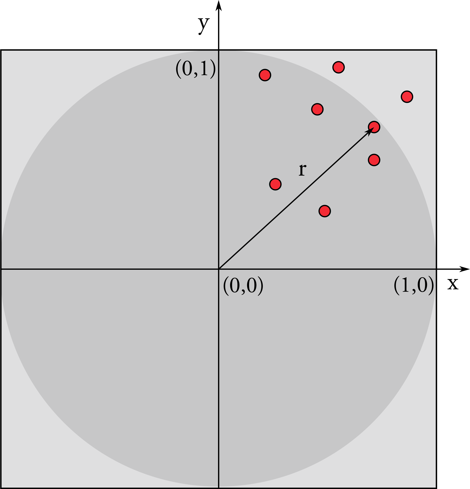

### Environment
Make sure you are using the correct environment!

### Hello World
```C++
#include <thread>
#include <iostream>
int main()
{
   auto f = [](int i){
   std::cout << "hello world from thread " << i << std::endl;
  };
//Construct a thread which runs the function f
  std::thread t0(f,0);

//and then destroy it by joining it
  t0.join();
}
```

Compile with:
```
g++ std_threads.cpp -lpthread -o std_threads
```


### Measuring time intervals
```C++
#include <chrono>
...
auto start = std::chrono::steady_clock::now();
  foo();
auto stop = std::chrono::steady_clock::now();
std::chrono::duration<double> dur= stop - start;
std::cout << dur.count() << " seconds" << std::endl;
```
### Exercise 1. Reduction

```C++
#include <iostream>
#include <random>
#include <utility>
#include <vector>
#include <chrono>

int main(){

  const unsigned int numElements= 100000000;   

  std::vector<int> input;
  input.reserve(numElements);

  std::mt19937 engine;
  std::uniform_int_distribution<> uniformDist(-5,5);
  for ( unsigned int i=0 ; i< numElements ; ++i) input.emplace_back(uniformDist(engine));

  long long int sum= 0;

  auto f= [&](unsigned long long firstIndex, unsigned long long lastIndex){
    for (auto it= firstIndex; it < lastIndex; ++it){
        sum+= input[it];
    }
  };

  auto start = std::chrono::system_clock::now();
  f(0,numElements);
  std::chrono::duration<double> dur= std::chrono::system_clock::now() - start;
  std::cout << "Time spent in reduction: " << dur.count() << " seconds" << std::endl;
  std::cout << "Sum result: " << sum << std::endl;
  return 0;
}
```

### Quickly create threads
```C++
unsigned int n = std::thread::hardware_concurrency();
std::vector<std::thread> v;
for (int i = 0; i < n; ++i) {
     v.emplace_back(f,i);
}
for (auto& t : v) {
    t.join();
}
```

### Exercise 2. Numerical Integration
```C++
#include <iostream>
#include <iomanip>
#include <chrono>

int main()
{
  double sum = 0.;
  constexpr unsigned int num_steps = 1 << 22;
  double pi = 0.0;
  constexpr double step = 1.0/(double) num_steps;
  auto start = std::chrono::system_clock::now();
  for (int i=0; i< num_steps; i++){
    auto  x = (i+0.5)/num_steps;
    sum = sum + 4.0/(1.0+x*x);
  }
  auto stop = std::chrono::system_clock::now();
  std::chrono::duration<double> dur= stop - start;
  std::cout << dur.count() << " seconds" << std::endl;
  pi = step * sum;

  std::cout << "result: " <<  std::setprecision (15) << pi << std::endl;
}

```


### Exercise 3. pi with Montecarlo

.

The area of the circle is pi and the area of the square is 4.

Generate `N` random floats `x` and `y` between `-1` and `1` [https://en.cppreference.com/w/cpp/numeric/random/uniform_real_distribution](https://en.cppreference.com/w/cpp/numeric/random/uniform_real_distribution).

Calculate the distance `r` of your point from the origin.

If `r < 1`: the point is inside the circle and increase `Nin`.

The ratio between `Nin` and `N` converges to the ratio between the areas.

<!-- 
#### Parallel Algos

```C++
#include <vector>
#include <algorithm>
#include <execution>

int main() {
  constexpr int N = 10000;
  std::vector<int> input;
  std::vector<int> output;
  output.resize(N);
  // fill the vector
  for (int i = 0; i < N; ++i) {
   ....
  }
  // sort it in parallel
  std::sort(std::execution::par, v.begin(), v.end());

  auto foo = [](int i) -> int { return i * -2; };

  // apply a function foo to each element of v 
  std::transform(std::execution::par_unseq, v.begin(), v.end(), output.begin(), foo);
}
``` -->

### Setting the environment for Intel oneTBB

Check your environment! 

```bash
echo $TBBROOT
```

To compile and link:
```bash
g++ -O2 algo_par.cpp  -ltbb
```
Let's check that you can compile a simple tbb program:

```C++
#include <cstdint>
#include <oneapi/tbb.h>
#include <oneapi/tbb/info.h>
#include <oneapi/tbb/parallel_for.h>
#include <oneapi/tbb/task_arena.h>
#include <cassert>

int main() {
  // Get the default number of threads
  int num_threads = oneapi::tbb::info::default_concurrency();

  // Run the default parallelism
  oneapi::tbb::parallel_for(
      oneapi::tbb::blocked_range<size_t>(0, 20),
      [=](const oneapi::tbb::blocked_range<size_t> &r) {
        // Assert the maximum number of threads
        assert(num_threads == oneapi::tbb::this_task_arena::max_concurrency());
      });

  // Create the default task_arena
  oneapi::tbb::task_arena arena;
  arena.execute([=] {
    oneapi::tbb::parallel_for(
        oneapi::tbb::blocked_range<size_t>(0, 20),
        [=](const oneapi::tbb::blocked_range<size_t> &r) {
          // Assert the maximum number of threads
          assert(num_threads ==
                 oneapi::tbb::this_task_arena::max_concurrency());
        });
  });

  return 0;
}
```

Compile with:
```bash
g++ your_first_tbb_program.cpp -ltbb 
```

### Your TBB Thread pool
```C++
// analogous to hardware_concurrency, number of hw threads:
int num_threads = oneapi::tbb::info::default_concurrency();

// or if you wish to force a number of threads:
auto t = 10; //running with 10 threads
oneapi::tbb::task_arena arena(t);

// And query an arena for the number of threads used:
auto max = oneapi::tbb::this_task_arena::max_concurrency();
// Limit the number of threads to two for all oneTBB parallel interfaces
oneapi::tbb::global_control global_limit(oneapi::tbb::global_control::max_allowed_parallelism, 2);
```

### Task parallelism

A task is submitted to a task_group as in the following.
The `run` method is asynchronous. In order to be sure that the task has completed, the `wait` method has to be launched.
Alternatively, the `run_and_wait` method can be used.


```C++
#include <iostream>
#include <oneapi/tbb.h>
#include <oneapi/tbb/task_group.h>

using namespace oneapi::tbb;

int Fib(int n) {
  if (n < 2) {
    return n;
  } else {
    int x, y;
    task_group g;
    g.run([&] { x = Fib(n - 1); }); // spawn a task
    g.run([&] { y = Fib(n - 2); }); // spawn another task
    g.wait();                       // wait for both tasks to complete
    return x + y;
  }
}

int main() {
  std::cout << Fib(32) << std::endl;
  return 0;
}
```

### Bonus: Graph Traversal

Generate a direct acyclic graph represented as a `std::vector<Vertex> graph` of 20 vertices:
```C++
struct Vertex {
  int N;
  std::vector<int> Neighbors;
}
```

If there is a connection from `A` to `B`, the index of the element `B` in `graph` needs to be pushed into `A.Neighbors`.
Make sure that from the first element of `graph` you can visit the entire graph.

Once generated, when you visit a vertex `X` of the graph, you compute `Fib(X.N)`. Generate `Vertex.N` uniformly between 30 and 40.

Remember to keep track of which vertex has already been visited.
