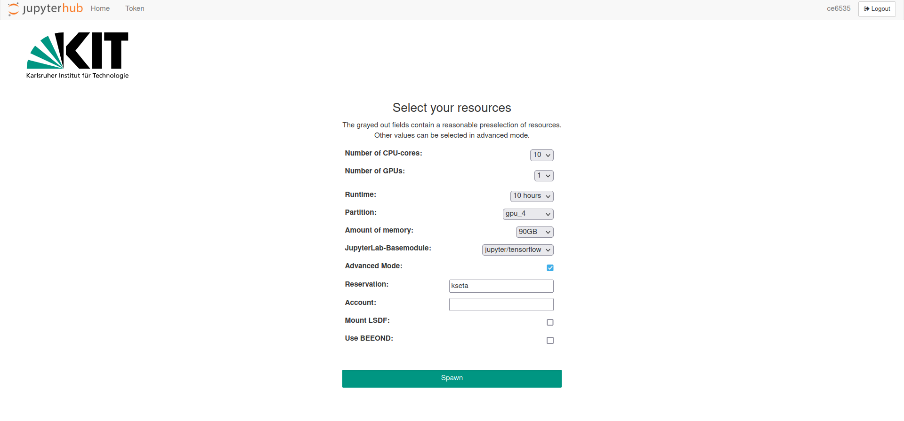
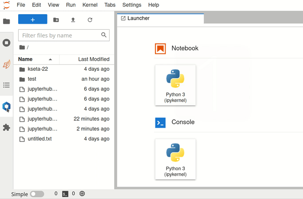

## How to connect to JupyterHub

- The KIT VPN is required to connect to the remote cluster. 
  - Information to use the KIT VPN can be found here [https://www.scc.kit.edu/en/services/vpn.php](https://www.scc.kit.edu/en/services/vpn.php). Under **Remote Access (VPN)**, select your operating system and follow the instructions

 - With the VPN enabled, ```ssh <username>@uc2.scc.kit.edu```. This is needed to trigger the creation of your home folder.

 - Visit [https://uc2-jupyter.scc.kit.edu/hub/home](https://uc2-jupyter.scc.kit.edu/hub/home) , select your organization and login with your credentials. You should see the following page

 [](start_server.png)

 - Click on "Start My Server", you will be redirected to 

 [](server_conf.png)

 - Configure the server as follows: **Note** to select ```gpu_4``` you have to click on Advanced Mode first. **Remember** to write ```kseta``` in Reservation, this gives you priority in the queue.

 [](server_configured.png)

<div style="page-break-after: always; break-after: page;"></div>

 - Click on Spawn and wait the server launch!  


## Configure Jupyter Notebook 
 - Once you are logged in you should be able to see the following interface:

[](jupy_start.png)

- Before doing anything, load the following modules:
    - ``` compiler/gnu/9.3 ```
    -  ```devel/tbb/2021.4.0```
    - ```devel/cuda/11.4```

[](./jupy-modules.gif)

- Now you can open a shell and download the repository for the exercises! 
    - ```git clone https://github.com/felicepantaleo/kseta-22```

- Enjoy the hacking! 